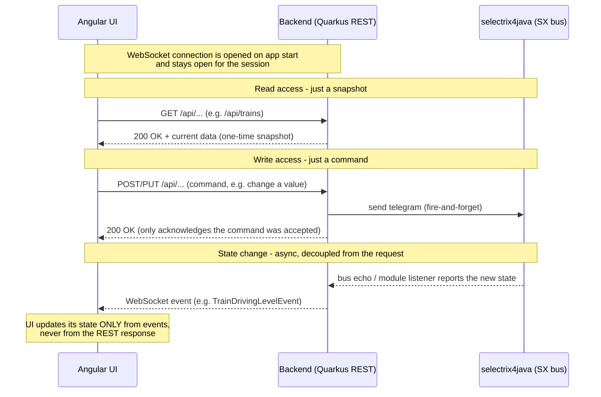
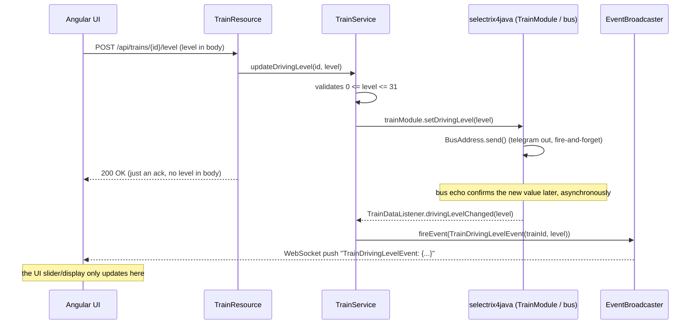

# Communication Flow: UI → Backend → selectrix4java

Two simplified sequence diagrams showing how the Angular UI communicates
with the Quarkus backend, and how the backend talks to the hardware via
`selectrix4java`. The key point: REST requests almost always either fetch a
snapshot or submit a command (a bare acknowledgement, no new state in the
response body). The actual state is delivered exclusively and
asynchronously via a WebSocket event, once the hardware reports the change
back.

## 1. General pattern

## 2. Example: changing a train's `drivingLevel`

Concrete flow for `POST /api/trains/{id}/level`
(`TrainResource` → `TrainService` → `selectrix4java` `TrainModule`).
The REST response only confirms the command was received; the value that
actually takes effect only arrives via `TrainDrivingLevelEvent`, fired by
the `TrainDataListener` that `TrainService` registers on the `TrainModule`
at startup.

